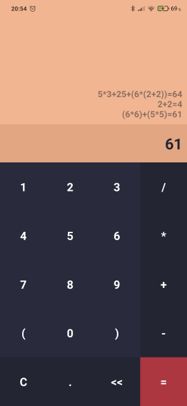

#  Calculator

This is my first app using React Native framework.

## How it works

### Front-end
Everything here is in adaptive layout, all text is in the ScrollViews.

All input is processed and corrected, if needed.

When the application starts a splash screen with a logo appears.

### Back-end
Calculation consists of 3 steps:
1. **Parsing** - split an expression into an array of tokens `[5, *, 3, +, (, 6, *, (, 2, +, 2, ), )]`
2. **Formation of the operation tree** -  

3. **Using the operation tree to evaluate the expression** - go from the leaves to the root and produce output
